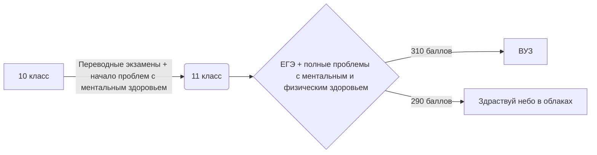

# Ig0g0i.github.io
Голинский
моя личная страница

1)sql запросы - запросы SQL в баз данных

2)создание базы данных.py - создание базы данных

3)sql запросы

4)python шпора.ipynb

5)golinskiy.png - нейро симулятор

6)bdtest.py 

$$W=\frac{qU}{2}=\frac{CU^{2}}{2}=\frac{q^{2}}{2C}$$

$$T=2\pi\sqrt{LC}$$

$$\overline{E}_1^2=\sqrt\frac{Fa^{x-1}}{(x-1)\cdot x}+\alpha_1{}^{\frac{1}{3}}{}+\beta_2^{\frac{2}{3}}$$

